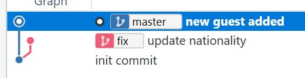
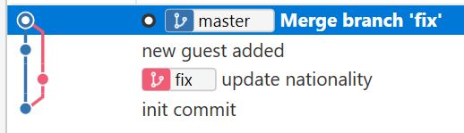
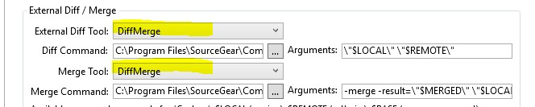
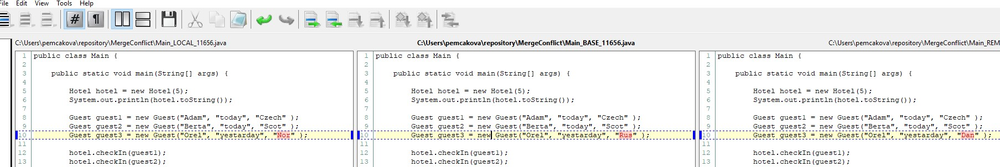
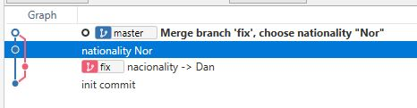
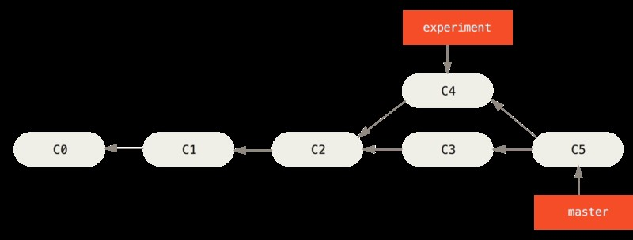
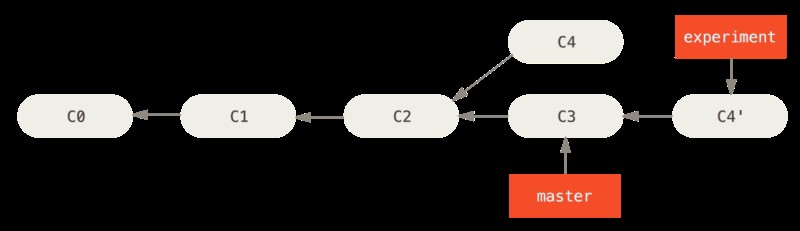
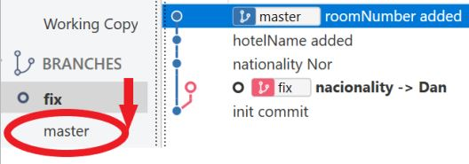
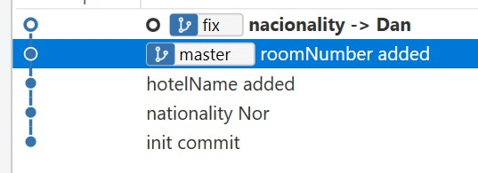
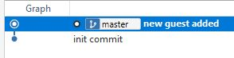

# Branching

In Git Bash and in SourceTree

Vìtvení znamená, že se mùžete odlouèit od hlavní linie vývoje a pokraèovat v práci, 
aniž byste do hlavní linie zasahovali. Git neukládá data jako sérii zmìn nebo rozdílù, 
ale jako sérii snímkù. Tento snímek / objekt obsahuje jméno a e-mail autora, 
zprávu  a odkazy na jeden nebo víc objektù revize, které této revizi pøímo pøedcházely (jeho rodièe): na žádného rodièe pro poèáteèní revizi, na jednoho rodièe pro bìžnou revizi a na více rodièù pro revizi, která je výsledkem slouèení dvou nebo více vìtví.

Dosud jsme pracovali jen s jednou  vìtví, øíkali jsme jí _master_ (vzniká pøi `git init`, 
její název není nutné mìnit). Nyní vytvoøíme novou vìtev. Proè ? I když kod vyvíjí jednotlivec, 
je velmi bezpeèné vyvíjet všechny nové funkce/opravy na vlastních vìtvích a pøitom mít 
v hlavní vìtvi - _masteru_ - zachovaný funkèní kód.

Jakmile pracujete v týmu, je používání vìtví naprosto nezbytnou záležitostí: 
jen tak má totiž každý vývojáø jistotu, že nepøepisuje kód nìkomu jinému. 
Vytvoøení nové vìtve znamená vytvoøení nového ukazatele na aktuální revizi.
  
## New branch
Novou vìtev vytvoøíme pøíkazem
 
`git branch <branch-name>`

Abychom v tomto místì mohli odklonit svoji práci, 
musíme se do nové vìtve pøepnout. 
To provedeme pøíkazem `checkout`.  

`git checkout <branch-name>`

_Pozn.: Pokud jsou v aktuálním pracovní vìtvi zmìnìné, ale neuložené soubory, 
git vypíše varování a pøepnutí na jinou vìtev neprovede_
 
V nové vìtvi provedeme zmìny v kodu a potvrdíme je commitem.

`git commit -a`  
 
Pøepneme do vìtve master `git checkout fix`, provedeme zmìny v kódu, napø. pøidáme soubor, 
potvrdíme zmìnu a zøetelnì vidíme vìtvení.
Seznam všech vìtví v repositáøi vypíšeme pøíkazem 
  
`git branch`

**Example in Git Bash:**  
_Repository for example: NewBranchStart.zip_

1. Create new branch, name it _fix_ 
2. Switch to the new branch
3. Make changes in code
4. Commit changes
5. Look at the result, list of all branches

  
Click here for solution 

    
  1. `git branch fix`  
  2. `git checkout fix`
  3. Changes in code
  4. `git commit -a`
  5. `git branch`  

  
 

**Do the some in SourceTree.**   
_Remove NewBranch folder from repository and unpack NewBranchStart.zip and copy again._

Result is:

## Merge

Výpisem vìtví `git branch` zjistíme, že práce rozdìlila. 
Zmìny provedené v obou vìtvích nyní chceme spojit do jedné. Vìtev _fix_ vložíme / pøipojíme do vìtve _master_ 
pøíkazem `merge`. Jmenovaná vìtev se spojí s vìtví, ve které se právì nacházíme.
 
`git merge <branch-name>`

**Example in Git Bash:**  
_Repository for example: MergeStart.zip_

1. Join _fix_ branch to _master_.
2. Look at the result, list of all branches

  
Click here for solution

    
  1. `git checkout master`
  1. `git merge fix`    
  2. `git branch`    

  
 

**Do the some in SourceTree.**  
_Remove Merge folder from repository and unpack MergeStart.zip and copy again._   

Result is:

## Set extern merge tool in SourceTree

1. Download from _https://sourcegear.com/diffmerge/downloads.php_ .  
2. Install.  
3. Set in SourceTree menu - Options / Diff 

## Merge with conflict

Lets have two branches and made different changes in both in the some place.  
Now merge them.

`git merge <branch-name>` 

We got the message about merge conflict. It looks like this:
  
`...`  
`_Auto-merging Main.java_`  
_`CONFLICT (content): Merge conflict in Main.java`_   
_`Automatic merge failed; fix conflicts and then commit the result._`_

Git makes notes, marks the places of the conflict in the files. It looks like this:
  
_File Main.java:_  

_`<<<<<<< HEAD`_  
_Guest guest3 = new Guest("Orel", "yestarday", "Nor" );_  
_=======_  
_Guest guest3 = new Guest("Orel", "yestarday", "Dan" );_  
_.>>>>>>> fix_

You have to fix changes manualy, save file and commit.   

`git commit -a`

Notepad++ (or other tool you set before) is opened. Update merge message, save file and close Notepad++ .

**Example in Git Bash:**  
_Repository for example: MergeConfictStart.zip_

1. Join _fix_ branch to _master_.
3. Resolve merge conflict.
2. Look at the result, list of all branches.

  
Click here for solution 

    
  1. `git checkout master`
  2. `git merge fix` Merge conflict message is shown.
  3. Change Main.java file and save it.
  4. `git commit -a`  
  5. Extern editor is opened. Edit ( or not ) commit message, save file and close editor.  
  6. Message about suceessfull merging is shown. Similar like this :  
     _Merge branch 'fix'.Resolved conflict in Main.java_      

  

**Do the some in SourceTree.**  
_Remove MergeConfict folder from repository and unpack MergeConfictStart.zip and copy again._ 

1. On branch master / Merge /  select branch-commit which  has to be merged / OK
2. Megre conflict message window is shown. 
3. Close it. In stage / unstage section are shown files with conflict. Right click 
on file, choose Resolve conflict / Launch External Tool. External merge tool window is opened. 

4. Make changes, save and close Diff merge.
5. Commit / update message / ok

Result is:  

## Rebase  (pøeskládání)  

Rozdíl mezi merge a rebase
 
 Merge   
 

 Rebase  
 

Pøíkazem `rebase` vezmete všechny zmìny, které byly zapsány v jedné vìtvi
a necháte je pøehrát na jinou vìtev. 
Používá se pokud byla vìtev, ve které se provedly zmìny, 
oddìlena z jiné vìtve (zpravidla _master_) pøed delší dobou, takže v pùvodní vìtvi došlo ke zmìnám, 
mùžeme chtít místo viditelného slouèení vìtví aplikovat zmìny ze své vìtve 
do hlavní vìtve.

Ve koneèném výsledku  není žádný rozdíl mezi merge a rebase. Výsledkem rebase je však èistší historie.
Pøíkaz pro pøeskládání je 

`git rebase <branch-name>`  

Dojde-li ke konfliktu, podobnì jako v pøedchozím pøípadì pøi `merge`, opìt provedeme manuálnì 
opravu souboru, pøidáme opravený soubor do oblasti pøipravovaných zmìn

`git add <changed-file>`

a potvrdíme ukoèení pøíkazu rebase

`git rebase --continue`  

**Example in Git Bash:**  
_Repository for example: RebaseWithConflict.zip_

1. Rebase branch _fix_ on branch _master_
2. Look at the result, list of all branches.

  
Click here for solution 

    
  1. `git checkout fix`
  2. `git rebase fix` Merge conflict message is shown.
  3. Change Main.java file and save it.
  4. `git add Main.java`
  5. `git rebase --continue` 
  6. `git branch` 

  

**Do the some in SourceTree.**  
_Repository for example: RebaseWithConflictStart.zip_ 

1. Right click on master / Rebase current changes onto master  

 Merge conflict message is shown
2. Resolve conflict with extern tool (some path as in merge was) 
3. Finally click to “uncommitted changes”
4. In main menu click Action / Continue rebase. 
 
 Result is:  

  
## Delete branch

používáme zpravidla ve chvíli, kdy již vìtev nebudeme nadále potøebovat, protože jsme ji zmergovali.  
Ke smazání vìtve slouží atribut `–d`.  
 
 `git branch –d <branch_name>`

Pokud vìtev nebyla namergovaná do jiné vìtve, pøíkaz vypíše varování a vìtev nezruší. 
Pokud chceme vìtev opravdu zrušit, použijeme parametr (velké) `-D`.

**Example in Git Bash:**  
_Repository for example: MergeStart.zip_

1. List all branches
2. Remove branch _fix_
3. List all branches

  
Click here for solution 

    
  1. `git branch`
  2. `git branch -d fix` 
  3. `git branch -D fix`
  4. `git branch`

 

**Do the some in SourceTree.**   
_Repository for example: Merge.zip_

Result is:  

