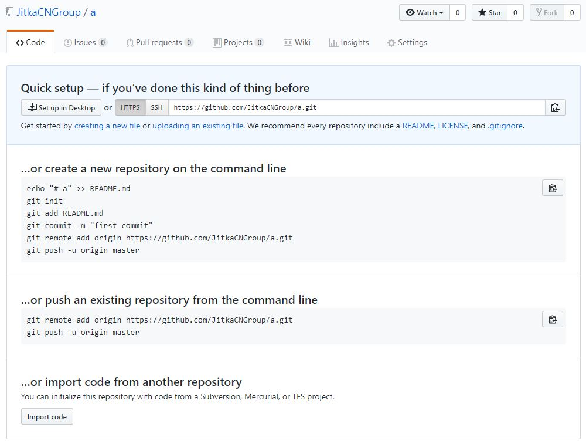

# Getting started.

## Download GitBegin tutorial

* Go to URL: https://github.com/JitkaCNGroup/CNGitBegin   
* Click **_Clone or download  / Download ZIP_**  
* Unpack it e.g to the _user-home / Document_ folder. 

* Create  _user_home / repository_ folder.

## Instalace GIT

VIDEO: https://www.youtube.com/watch?v=SmbAn2_5uGs

* Go to URL: https://git-scm.com/downloads  
* Download Git  
 
To check correct installation, run Git Bash, run command  
  
`git --version`  

Answer should look like this: _git version 2.17.0.windows.1_

### Nápověda 
Nápovědu Git-u a nápovědu pro jednotlivé příkazy je k dispozici v příkazové řádce:

`git help`  
`git help pull`

**Example in Git Bash:**  
1. Get help for command _commit_ 

  
Click here for solution 
    
    
  1. `git help commit`

### Nastavení totožnosti

je první krok nutný pro práci s Git-em.   
VIDEO: https://www.youtube.com/watch?v=tq1Rmkz0XIo

`git config – global user.name "Jmeno Prijmeni"`  
`git config – global user.email "Prijmeni@gmail.com"`

Kontrola nastavení:

`git config --list`

**Example in Git Bash:**  

1. Set your name and e-mail
2. Check your settings  

  
Click here for solution 
    
    
  1. `git config – global user.name "Jana Mala"`  
  2. `git config – global user.email "mala@gmail.com"`
  3. `git config --list`

### Nastavení editoru

Download Notepad++ from 
URL: https://notepad-plus-plus.org/download/v7.6.2.html and set it for Git:

`git config --global core.editor "'C:/Program Files/Notepad++/notepad++.exe' -multiInst -notabbar -nosession -noPlugin"`

**Example in Git Bash:**
1. Check, how your editor is set.

    
Click here for solution 

     
   1. `git config --list` or  `git config --get core.editor`
 

 

### Soubory nastavení

* Soubor **/etc/gitconfig** obsahuje údaje pro **všechny uživatele systému a pro všechny 
repozitáře**. Příkazem     

    `git config --system`  

    je Git čte a zapisuje do souboru _c:\Program Files\Git\mingw64\etc\gitconfig_.

* Soubor **../user-home/.gitconfig** (nebo **../user-home/.config/git/config**) patří k **jednomu uživatelskému účtu**. 
Čtení a zápis do tohoto souboru se provádí příkazem
 
    `git config --global`

* Další nastavení jsou v souboru **.git/config** a jsou vztažena k jednomu konkrétnímu repositáři   
_..user-home/repository/GitExample/.git_ . Čte a zpisuje se do něj příkazem  

    `git config --local`  

    a musí být použit jen v adresáři repozitáře.   

**Example in Git Bash:**
1. Write down content of git system config file end compare with file
1. Write down content of git global config file end compare with file

    
Click here for solution 

     
   1. `git config --system -l`
   2. `git config --global -l`
 

## Vytvoření lokálního repozitáře projektu

Mějme projekt <projekt-name> ve složce ../user-home/repository. Repozitář Git se vytvoří jediným příkazem  
 
`git init`

Přidejme všechny soubory projektu ke sledování (více bude vysvětleno v další kapitole ) příkazem

`git add -A`

a vytvořte první revizi / commit s popisem

`git commit -m '<text>'`

**Example in Git Bash:**
_Directory for example: FilesStart.zip_

1. Unpack and copy _code examples / FileStart.zip_ into _../ user-home / repository_
2. Create Git repository in folder Init.
4. Add all files to tracking 
4. Create first commit with message "First commit"

  
Click here for solution 

     
  1. In Git bash switch to  _../user-home/repository/Init_  
    `cd repository`  
    `cd Init` ("Init" here is name of folder)
  2. `git init` ("init" here is command)
  3. `git add -A`
  4. `git commit -m 'First commit'`

 

## SourceTree

je desktopová aplikace, která zjednodušuje práci s repozitáři, vizualizuje je a spravuje je pomocí 
jednoduchého uživatelského rozhraní.

### Instalace

Download SourceTree from URL: https://www.sourcetreeapp.com/ and install it.

### Zobrazení repozitáře v SourceTree

* Přidejte do SourceTree repozitář vytvořený v předchozí kapitole:  
_„+&quot; / Add / Browse  / select directory Init / Add_

* Zkontrolujte nastavení uživatele:  
 _Tools / Options_

* Zkontrolujte nastavení právě přidaného repozitáře Init:  
_Repository / Repository settings / Edit Config File / select editor / OK_

## GitHub

### Vytvoření účtu na GitHub

URL: [https://github.com](https://github.com)

VIDEO: https://www.youtube.com/watch?v=2NxsjFtGjBA

### Vytvoření vzdáleného repozitáře (remote repository) na GitHub

 se ke svému účtu na GitHub-u vytvořte nový repositář:
  1. Vpravo nahoře click "+",
  2. Vložte název repozitáře, případně popis, nepřidávajte zatím žádné další soubory
  3. _Create repository_, Zobrazí se velmi užitečný návod, jak dál postupovat.  
  
   4. Přepněte se v Git Bash do adresáře Init a postupujte podle kroku  
    _... or push existing_   
`git remote add origin https://github.com/<your-name>/Init.git`  
      `git push -u origin master`

Pozn.: V případě chyby fatal: _remote origin already exists_ look at video
https://www.youtube.com/watch?v=TPu31mT6EHo

Nyní máme vytvořéný **lokální repozitář** a je **zálohovaný na vzdálený** server.

Poslední krok v této kapitule bude krok opačný:

### Získání vzdáleného / remote repozitáře klonováním

Využívá se v případě, že např. chcete začít přispívat do již existujícího projektu. Používá se příkaz  

`git clone` 

Příkaz vytvoří adresář projektu, inicializuje v něm adresář .git, stáhne všechna data pro tento repozitář a vytvoří pracovní kopii nejnovější verze.

**Example in Git Bash:**

1. Run help for command `clone`.
2. Clone repository https://github.com/JitkaCNGroup/InitClone from GitHub.

  
Click here for solution 

    
  1. `git help clone`
  2. Go to https://github.com/JitkaCNGroup/InitClone,   
  3. click _**Clone or download**_ button  
  4. check **_Clone with HTTPS_** is set  
  5. copy string into the clipboard and run   
   `git clone https://github.com/JitkaCNGroup/InitClone.git`  
 in Git Bash from _user-home/repository_ directory

 

**Delete all files from InitClone directory and clone it again in SourceTree.**   
