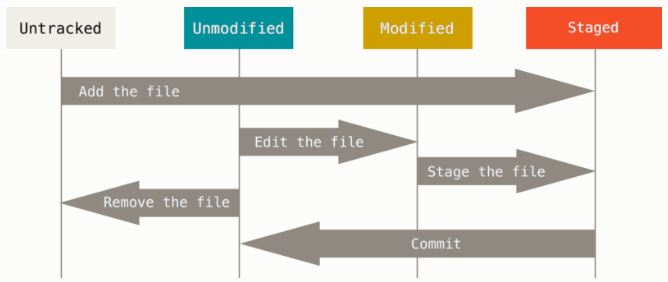
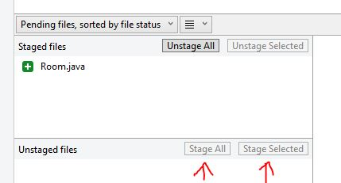
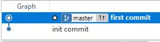

# Git Basics.

## Nahrávání změn do repozitáře
Úplná dokumentace k následující kapitole:  
URL: https://git-scm.com/book/cs/v2/Z%C3%A1klady-pr%C3%A1ce-se-syst%C3%A9mem-Git-Nahr%C3%A1v%C3%A1n%C3%AD-zm%C4%9Bn-do-repozit%C3%A1%C5%99e 

Každý soubor v pracovním adresáři může být v jednou ze dvou stavů: 
sledován (tracked) a nesledován (untracked). Nesledované soubory jsou zapsány v souboru .gitignore     
Sledované soubory jsou ty soubory, které byly součástí posledního snímku. 
Mohou být ve stavu nezměněn (unmodified), změněn (modified) nebo připraven k zapsání (staged).

  

### Kontrola stavu souborů

se provádí příkazem   

`git status`

JInak řečeno - příkaz zobrazuje status pracovního stromu. 
Má velké množství parametrů, které jsou zmíněny v dokumentaci: https://git-scm.com/docs/git-status

### Přidání souborů ke sledování

se provádí příkazem `add`

`git add <file-name>`

**Example in Git Bash:**  
_Repository for example: Init.zip_, Room.java file

1. Add _Room.java_ file from _code examples_ folder to the Git repository
2. Move it into the tracking area  

  
Click here for solution 

    
  1. Copy Room.java file from _code example_ folder to Init folder
  2. `git status`
  3. `git add Room.java`
  4. `git status` 
  

 

**Do the some in SourceTree.**   
_Repository for example: Init.zip_, Room.java file

Result is:  

### Příprava modifikovaných souborů k zapsání

Nyní provedeme změny v souboru, který už byl sledován, 
a znovu zjistíme status pracovního stromu příkazem `git status`. 

Soubor je uveden v části výpisu  _Changes not staged for commit_ (změny, které nejsou připraveny k zapsání). 
Znamená to, že soubor, který je sledován, byl v pracovním adresáři změněn, 
avšak ještě nebyl připraven k zapsání (staged). 
K zapsání ho připravíme opět provedením příkazu

`git add <file-name>`
 
**Příkaz git add je víceúčelový** - používá se k zahájení sledování nových souborů, 
k přípravě modifikovaných souborů k zapsání a k dalším věcem. 
Uvažujte o něm spíše ve smyslu „přidej tento obsah do dalšího snímku“ 
než ve smyslu „přidej tento soubor do projektu“. 

**Example in Git Bash:**  
_Repository for example: Init.zip_

1. Make change in Hotel.java file. Add name of hotel behind _private ArrayList<Room>_ rooms; line. (_private String name;_)
2. Add file to the staged area. 

  
Click here for solution 

    
  1. Open Hotel.java file and make changes  
  
  _private ArrayList<Room> rooms;_  
  _private String name;_  
  2. Save file.
  3. `git status`
  4. `git add Hotel.java`
  

  

**Do the some in SourceTree.**   
_Repository for example: Init.zip_

### Zapisování změn

Nyní máme v oblasti změn / staged area dva soubory. Soubory zapíšeme do revize příkazem  
 
`git commit`

Protože jsme v předchozí kapitole nainstalovali externí editor, tento se otevře, 
do prvního řádku vpíšeme text popisující změny, uložíme a editor zavřeme.  

Jiná možnost je zapsat zprávu k revizi je ta, že ji napíšeme přímo do řádku k příkazu commit. 
Jako zprávu ji označíte parametrem -m:

`git commit -m "<message>"`

**Example in Git Bash:**  
_Repository for example: CommitStart.zip_

1. Potvrdte změny připravené v repositáři

  
Click here for solution 

    
  1. `git commit -m "Room class added, hotel name added into Hotel class"`
  

### Přeskočení oblasti připravených změn

Oblast připravených změn představuje při určitém způsobu práce někdy zbytečnou 
komplikaci. Chcete-li oblast připravených změn úplně přeskočit a můžeme použít příkaz `commit` s parametrem. 

`git commit -a`

### Odstraňování souborů

z oblasti připravovaných změn / staged area se provádí příkazem `rm`.

`git rm <file-name>`

_(use --cached to keep the file, or -f to force removal)_ 

Parametr _--cached_ znamená, že soubor chcete ponechat na disku, ale nechcete, aby ho Git sledoval.

Parametr _-f_ znamená, pokud už jste soubor upravili a přidali do indexu, 
musíte odstranění vynutit přidáním této volby.

Odstranění souborů musí být také potvrzené příkazem `commit`.

**Example in Git Bash:**  
_Repository for example: CommitStart.zip_

1. Remove Room.java file from staged area.   
a. Try with `-f` parameter, check status.  
b. Restore Commit folder from CommitStart.zip and remove file with parameter `--cached`, check status. 

  
Click here for solution 

    
  1.a. `git rm --cached Room.java`, `git status`  
  1.b. `git rm -f Room.java`, `git status`
  

## Zobrazení historie revizí

`git log`  vypíše všechny revize daného repozitáře v obráceném chronologickém pořadí - poslední revize se zobrazí na začátku.

`git log -<n>` vypíše n posledních revizí

Podrobnější popis přikazu je zde:   
https://git-scm.com/book/cs/v2/Z%C3%A1klady-pr%C3%A1ce-se-syst%C3%A9mem-Git-Zobrazen%C3%AD-historie-reviz%C3%AD.

Použití příkazové řádky pro prohlížení historie je méně obvyklé a méně přehledné.
Právě pro sledování historie je vhodnější grafických nástrojů, např. SourceTree.

## Návrat do předchozího stavu

### Přidání změn k předchozí revizi 

V tomto případě nejde ani tak o návrat k předchozímu stavu, 
jako spíše o dodatečné přidání změn 
(tj. přidání dalšího souboru, změna souboru, změna zprávy k revizi)
 k předchozí revizi.

`git commit --amend` 

**Example in Git Bash:**  
_Repository for example: AmendStart.zip_

1. Confirm prepared changes in Hotel.java file and let previous message.

  
Click here for solution 
  
      
  1. `git add Hotel.java`  
  2. `git commit --amend`
  

  

**Do the some in SourceTree.**   
_Repository for example: AmendStart.zip_

Result is:  

### Rušení změn v modifikovaných souborech
(Unmodifying a Modified File) 

které ještě nejsou uloženy v oblasti připravených změn provedete příkazem  

`git checkout -- <file-name>`

**Example in Git Bash:**  
_Repository for example: AmendStart.zip_

1. Return back changes made in Hotel.java file.

  
Click here for solution 
  
      
  1. `git status`  
  2. `git checkout -- Hotel.java`

### Odstranění souboru z oblasti připravených změn 
(Unstaging a Staged File)

Řekněme například, že jste změnili dva soubory a chcete je zapsat 
jako dvě oddělené změny (commity), jenže omylem jste zadali příkaz `git add *` 
a oba soubory jste tím připravili k zapsání. Přitom potvrdit chceme jen jeden. 
Soubor v oblasti připravených změn vyjmem příkazem 

`git reset HEAD <file-name>`

**Example in Git Bash:**  
_Repository for example: CommitStart.zip_

1. From staged area remove Hotel.java file.

  
Click here for solution 
  
      
  1. `git status`  
  2. ` git reset HEAD Hotel.java`

## Jak zakázat sledování změn v adresářích - .gitignore

V adresáři projektu se často vyskytují soubory, které nechceme sledovat. Např. 
automaticky vygenerované soubory, logy, ... To vyřešíme tak, že v repositáři vytvořime soubor **.gitignore** 
se seznamem masek pro ignorované soubory. 

**Example of .gitignore file**

`*.class`  
`*.log`
`*.jar`  
`*.war`  
`*.rar`  
`.idea/**/workspace.xml`  
`.idea/**/tasks.xml`  
`.idea/**/dictionaries`  
`.idea/**/shelf`

_Pozn. Nepomohlo? Soubory stále zůstávají ve staged area?  
Zkuste `git rm -r –cached`, např. `git rm -r --cached .idea`_

VIDEO: https://www.youtube.com/watch?v=HVsySz-h9r4