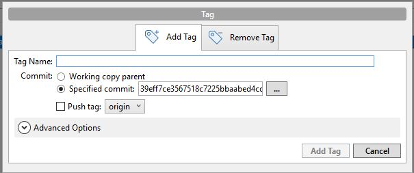

# Working with remotes

V první kapitole jsme se setkali s vytvořením vzdáleného repozitáře na GitHub. Lokální repositář jsme zazálohavali na vzdálený server a take jsme z remote serveru naklonovali repozitář na lokální PC.
Nyní se podíváme na další akce se vzdáleným repozitářem.

## Zobrazení vzdálených serverů

`git remote`

`git remote –v`  vrátí seznam vzdálených repositářů vč. URL adresy

Pokud byl repozitář vytvořen klonováním, 
zobrazí se minimálně jméno `origin`.  Jako výchozí název ho Git přidělí serveru, 
ze kterého byl vytvářeen klon.

**Example in Git Bash:**  
_Repository for example: InitClone.zip_

1. Show URL address of remote repository InitClone

  
Click here for solution 

    
  1. switch to repository _../repository/InitClone_   
  2. `git remote –v`

 
.   
 
_**Lector** make changes in InitClone / Main.java file and push them:_   
_cd InitClone/_  
_git status_  
_modified:   Main.java_  
_git commit -a_  
_git push origin master_
 
 
## Vyzvedávání a stahování ze vzdálených repozitářů

`git fetch`

Vyzvedne veškerou novou práci, která byla na uvedený server poslána (vámi, nebo spíš někým jiným) 
od okamžiku, kdy jste odtud klonovali nebo kdy jste odtud naposledy vyzvedávali práci. 
Jinak řečeno  stáhne data do lokálního repozitáře, ALE neprovede automatické sloučení 
s prací, ani nezmění nic z toho, na čem právě pracujete.

`git pull`

vyzvedne data ze serveru (udělá totéž jako fetch), 
a navíc se je pokusí začlenit do kódu, na němž právě pracujete.

**Example in Git Bash:**  
_Repository for example: InitClone_

1. Update your InitClone repository and merge changes.
2. Check status of your working tree. 

  
Click here for solution 

    
  1. switch to repository _../repository/InitClone_   
  2. `git fetch`  
  3. `git status`  
  _On branch master_  
  _Your branch **is behind 'origin/master' by 1 commit**, and can be fast-forwarded._  
  _(**use "git pull"** to update your local branch)_  
  4. `git pull`  
  _Updating d55cc97..4190b69_  
  _Fast-forward_  
  _ **Main.java** | 1 +_  
   _1 file changed, 1 insertion(+)_  
  _Current branch master **is up to date**_
  5. `git status`  
  _Your branch **is up to date** with 'origin/master'._

Watch each step in **SourceTree** and try to find how to do it here.

## Odesílání do vzdálených repozitářů.

Po provedení změn a jejich uložení v lokálním repositáři (po commit) je potřebujeme odeslat do vzdáleného repozitáře. 
To provedeme příkazem
 
`git push <remote-server-name> <branch-name>`

Pokud chcete na server `origin` odeslat svou `master` větev  
(připomeňme, že při klonování se vám obě tato jména nastaví automaticky), 
provedeme příkaz

`git push origin master`

**Example in Git Bash:**  
_Repository for example: InitStart.zip_

1. Commit changes and push them to remote server.

  
Click here for solution 

    
    
  1. switch to repository _../repository/Init_  
  2. `git status`
  3. `git add Room.java`
  3. `git commit -m "Room.java file added" ` 
  4. `git push origin master`
  

Watch each step in **SourceTree** and try to find how to do it here.

# Používání značek / Tagging

Tagy se používají pro označení revizí, které považujeme za důležité.
Nejčastěji  pro označení vydání / release. 

Tagy lze vypsat příkazem

`git tag`

Vztvoření nové, anotované, značky se provede přidáním parametru -a.  

`git tag -a <tag-name> -m "<tag-description>"`

Tagem lze označit i starší revizi / commit 
přidáním kontrolního součtu nebo jeho části za příkaz.

`git tag -a v1.4 -m "my version 1.4"  39eff7c`

Tagy lze odstraňovat, sdílet se vzdáleným repozitářem , 
viz  https://git-scm.com/book/cs/v2/Z%C3%A1klady-pr%C3%A1ce-se-syst%C3%A9mem-Git-Pou%C5%BE%C3%ADv%C3%A1n%C3%AD-zna%C4%8Dek

**Example in Git Bash:**  
_Repository for example: InitStart.zip_

1. Add tag with dscription to the first init commit.
2. Show all tags

   
  
Click here for solution 

  1. `git log` to find out number of the first commit      
  2. `git tag -a v0.1 -m "init commit 0.1." d55cc97`  use your real commit number
  3. `git tag`
  

 

**Do the some in SourceTree.**  

Use context menu (right click) on commit.

